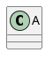
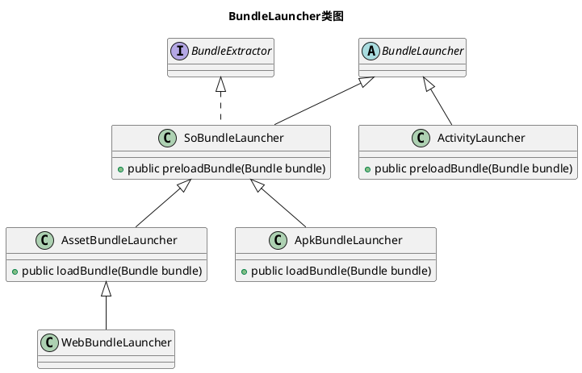

# 标题

在 Markdown 中，你只需要在文本前面加上 # 即可，同理、你还可以增加二级标题、三级标题、四级标题、五级标题和六级标题，总共六级，只需要增加 # 即可，标题字号相应降低。例如：
<!-- more -->
```
# 一级标题
## 二级标题
### 三级标题
#### 四级标题
##### 五级标题
###### 六级标题
```
注：`#` 和`「一级标题」`之间建议保留一个字符的空格，这是最标准的 Markdown 写法。
<!-- more -->  

# 分隔线

在一行连续使用三个或以上下划线_或*:
```
___
***
```
___
***
***

# 列表

列表格式也很常用，在 Markdown 中，你只需要在文字前面加上`-`就可以了，例如：
```
- 文本1
- 文本2
- 文本3
```

- 文本1
- 文本2
- 文本3

如果你希望有序列表，
也可以在文字前面加上`1.`就可以了，例如：
```
1. 文本1
1. 文本2
1. 文本3
```
1. 文本1
1. 文本2
1. 文本3

注：1.和文本之间要保留一个字符的空格。

# 链接

Markdown有两种链接方式：Inline（行内式）以及Reference（参考式）
```
[显示文本](链接地址) 
```
或
```
[显示文本][1]
[1]:链接地址
```
```
Inline:
[百度](https://www.baidu.com) 
Reference:
我经常去的几个网站[Baidu][1]、[Leanote][2]以及[自己的博客][3]
[Leanote 笔记][2]是一个不错的[网站][]。

[1]:http://www.baidu.com "Baidu"
[2]:http://www.leanote.com "Leanote"
[3]:http://http://blog.leanote.com/freewalk "梵居闹市"
[网站]:http://http://blog.leanote.com/freewalk
```
Inline:
[百度](https://www.baidu.com) 
Reference:
我经常去的几个网站[Baidu][1]、[Leanote][2]以及[自己的博客][3]
[Leanote 笔记][2]是一个不错的[网站][]。

[1]:http://www.baidu.com "Baidu"
[2]:http://www.leanote.com "Leanote"
[3]:http://http://blog.leanote.com/freewalk "梵居闹市"
[网站]:http://http://blog.leanote.com/freewalk

# 图片

```
 
```
或
```
![显示文本][1]
[1]:图片链接地址
```
例如：
```

```

注：插入图片的语法和链接的语法很像，只是前面多了一个 ！。

# 显示链接中带括号的图片
使用第二种方法，注意序号

```
![][1]
[1]: http://latex.codecogs.com/gif.latex?\prod%20\(n_{i}\)+1
```

![][5]

[5]: http://latex.codecogs.com/gif.latex?\prod%20\(n_{i}\)+1

或者用
```

```


# 引用

在我们写作的时候经常需要引用他人的文字，这个时候引用这个格式就很有必要了，在 Markdown 中，你只需要在你希望引用的文字前面加上`> `就好了，可以嵌套使用，例如：
```
> 一盏灯， 一片昏黄； 一简书， 一杯淡茶。 守着那一份淡定， 品读属于自己的寂寞。 
>> 保持淡定， 才能欣赏到最美丽的风景！ 保持淡定， 人生从此不再寂寞。
```
> 一盏灯， 一片昏黄； 一简书， 一杯淡茶。 守着那一份淡定， 品读属于自己的寂寞。 
>> 保持淡定， 才能欣赏到最美丽的风景！ 保持淡定， 人生从此不再寂寞。

注：> 和文本之间要保留一个字符的空格，标准用法。

# 粗体和斜体

Markdown 的粗体和斜体也非常简单，用两个 `*` 包含一段文本就是粗体的语法，用一个 `*` 包含一段文本就是斜体的语法。例如：
```
*一盏灯*， 一片昏黄；**一简书**， 一杯淡茶。 
```
*一盏灯*， 一片昏黄；**一简书**， 一杯淡茶。 

# 代码引用

1. 需要引用代码时，如果引用的语句只有一段，不分行，可以用 \` 将语句包起来。
2. 如果引用的语句为多行，可以将\`\`\`置于这段代码的首行和末行。
3. 每一行前边加入4个空格或者一个tab

# 表格

相关代码：
```
| Tables        | Are           | Cool  |
| ------------- |:-------------:| -----:|
| col 3 is      | right-aligned | $1600 |
| col 2 is      | centered      |   $12 |
| zebra stripes | are neat      |    $1 |
```
| Tables        | Are           | Cool  |
| ------------- |:-------------:| -----:|
| col 3 is      | right-aligned | $1600 |
| col 2 is      | centered      |   $12 |
| zebra stripes | are neat      |    $1 |

# 为输入的URL或邮箱自动创建链接

Markdown 支持以比较简短的自动链接形式来处理网址和电子邮件信箱，只要是用<>包起来， Markdown 就会自动把它转成链接。一般网址的链接文字就和链接地址一样，例如：
```
<http://example.com/>
<address@example.com>
```
<http://example.com/>
<address@example.com>

# 任务列表

- [x] @mentions, #refs, [links](), **formatting**, and <del>tags</del> supported
- [x] list syntax required (any unordered or ordered list supported)
- [x] this is a complete item
- [ ] this is an incomplete item
如果任务列表项目描述以圆括号开头，则需要通过以下方式将其解除\
- [ ] \(Optional) Open a followup issue

# 删除线

~~ 我被删除了~~
或者
<del>tags</del>

# 转义字符
Markdown中的转义字符为\，可以转义的有：
```
\\ 反斜杠
\` 反引号
\* 星号
\_ 下划线
\{\} 大括号
\[\] 中括号
\(\) 小括号
\# 井号
\+ 加号
\- 减号
\. 英文句号
\! 感叹号
```
\\ 反斜杠
\` 反引号
\* 星号
\_ 下划线
\{\} 大括号
\[\] 中括号
\(\) 小括号
\# 井号
\+ 加号
\- 减号
\. 英文句号
\! 感叹号

# 数学公式支持

麦克斯韦方程组：

$$
\begin{eqnarray}
\nabla\cdot\vec{E} &=& \frac{\rho}{\epsilon_0} \\
\nabla\cdot\vec{B} &=& 0 \\
\nabla\times\vec{E} &=& -\frac{\partial B}{\partial t} \\
\nabla\times\vec{B} &=& \mu_0\left(\vec{J}+\epsilon_0\frac{\partial E}{\partial t} \right)
\end{eqnarray}
$$

$$
H=-\sum_{i=1}^N (\sigma_{i}^x \sigma_{i+1}^x+g \sigma_{i}^z)
$$

$$
f(n) = \begin{cases}
 \frac{n}{2},
 & \text{if } n\text{ is even}
 \\ 3n+1, & \text{if } n\text{ is odd}
 \end{cases}
$$

The *Gamma function* satisfying $\Gamma(n) = (n-1)!\quad\forall n\in\mathbb N$ is via the Euler integral

$$
\Gamma(z) = \int_0^\infty t^{z-1}e^{-t}dt\,.
$$

## 行内式
$\sqrt{3x-1}+(1+x)^2$

# 流程图支持
https://github.com/bubkoo/hexo-filter-flowchart
npm install --save hexo-filter-flowchart
nano _config.yml
```
flowchart:
  # raphael:   # optional, the source url of raphael.js
  # flowchart: # optional, the source url of flowchart.js
  options: # options used for `drawSVG`
```

## 例子：
```flow
st=>start: Start
e=>end
op=>operation: My
cond=>condition: Yes or No?

st->op->cond->e
cond(yes)->e
cond(no)->op
```

## 例子：

```flow
st=>start: Start|past:>http://www.google.com[blank]
e=>end: End:>http://www.google.com
op1=>operation: My Operation|past
op2=>operation: Stuff|current
sub1=>subroutine: My Subroutine|invalid
cond=>condition: Yes
or No?|approved:>http://www.google.com
c2=>condition: Good idea|rejected
io=>inputoutput: catch something...|request

st->op1(right)->cond
cond(yes, right)->c2
cond(no)->sub1(left)->op1
c2(yes)->io->e
c2(no)->op2->e
```

# UML时序图支持
https://github.com/wafer-li/hexo-filter-plantuml
npm install --save hexo-filter-plantuml

## 例子：
```puml
Alice->Bob: Hello Bob, how are you?
Note right of Bob: Bob thinks
Bob-->Alice: I am good thanks!
```

## 例子：


## 例子：


# 下划线/emoji/下标/上标/脚注
https://github.com/CHENXCHEN/hexo-renderer-markdown-it-plus
```
sudo npm uninstall hexo-renderer-marked --save
sudo npm install hexo-renderer-markdown-it-plus --save
```

## 下划线
```
++Inserted++
```
++Inserted++

## emoji
https://www.webpagefx.com/tools/emoji-cheat-sheet/
https://github.com/markdown-it/markdown-it-emoji

### 短写：
  angry:            [ '>:(', '>:-(' ],
  blush:            [ ':")', ':-")' ],
  broken_heart:     [ '</3', '<\\3' ],
  // :\ and :-\ not used because of conflict with markdown escaping
  confused:         [ ':/', ':-/' ], // twemoji shows question
  cry:              [ ":'(", ":'-(", ':,(', ':,-(' ],
  frowning:         [ ':(', ':-(' ],
  heart:            [ '<3' ],
  imp:              [ ']:(', ']:-(' ],
  innocent:         [ 'o:)', 'O:)', 'o:-)', 'O:-)', '0:)', '0:-)' ],
  joy:              [ ":')", ":'-)", ':,)', ':,-)', ":'D", ":'-D", ':,D', ':,-D' ],
  kissing:          [ ':*', ':-*' ],
  laughing:         [ 'x-)', 'X-)' ],
  neutral_face:     [ ':|', ':-|' ],
  open_mouth:       [ ':o', ':-o', ':O', ':-O' ],
  rage:             [ ':@', ':-@' ],
  smile:            [ ':D', ':-D' ],
  smiley:           [ ':)', ':-)' ],
  smiling_imp:      [ ']:)', ']:-)' ],
  sob:              [ ":,'(", ":,'-(", ';(', ';-(' ],
  stuck_out_tongue: [ ':P', ':-P' ],
  sunglasses:       [ '8-)', 'B-)' ],
  sweat:            [ ',:(', ',:-(' ],
  sweat_smile:      [ ',:)', ',:-)' ],
  unamused:         [ ':s', ':-S', ':z', ':-Z', ':$', ':-$' ],
  wink:             [ ';)', ';-)' ]
## 下标
```
H~2~0
```
H~2~0

## 底部强调标记色
markdown-it-mark
`=mark==`
=mark==
